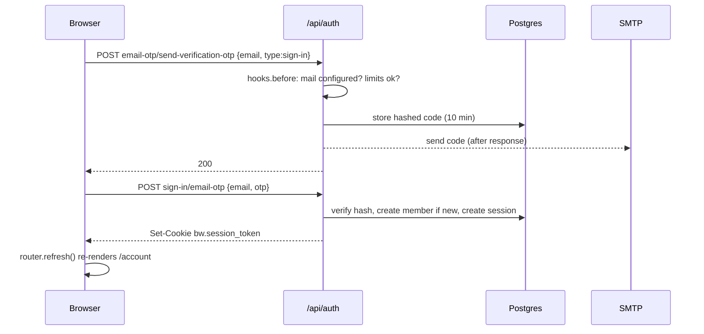

# Membership System Guide

Last updated: 2026-09-26

## Overview

Membership is free, and members sign in with a 6-digit code sent to their email. There are no passwords. Visitors sign up and sign in the same way: the first code a person enters creates their account.

- **Where members use it:** the `/account` page, in English and Chinese.
- **Where the data lives:** a Postgres database hosted by Neon. It is **not** in Sanity, so the Studio can't show or edit members.
- **What is stored:** email address, sign-up date, active sign-ins (sessions), pending codes, and rate-limit counters. No names, passwords or payment details.
- **Join key:** email is what links a member to Luma, Klaviyo and Shopify records.

This guide has two halves. Operators (non-technical crew) need only the next two sections. Developers should read everything.

## Managing members in the Neon Console

All member admin happens in the Neon Console at console.neon.tech. Every change there is live on the website immediately and cannot be undone, so read before you click.

### Getting in

1. Sign in to console.neon.tech with the account that owns the project (ask a developer to invite you).
2. Open the Blackwater project and make sure the branch selector says **production** (`main`) — other branches are test copies.
3. Click **Tables** in the left sidebar to browse, or **SQL Editor** to run a query.

### What each table is

| Table                 | One row per                            | Safe to edit?                             |
| --------------------- | -------------------------------------- | ----------------------------------------- |
| `member`              | person                                 | Yes, carefully — see below                |
| `member_session`      | signed-in browser                      | Delete only (signs that browser out)      |
| `member_verification` | code waiting to be typed               | Leave alone                               |
| `member_account`      | external login (always empty)          | Leave alone                               |
| `auth_rate_limit`     | per-IP counter                         | Leave alone                               |
| `sign_in_code_limit`  | per-email / per-IP / site-wide counter | Delete a row to lift a lock (see support) |

### Common tasks

- **Find a member:** open `member`, use the filter on `email`. Emails are stored lowercase.
- **Count members:** SQL Editor → `select count(*) from member;`
- **Sign a member out everywhere:** in `member_session`, filter `member_id` to their id and delete those rows. They are signed out on their next page load.
- **Change a member's email:** edit `email` in `member`. Their next code goes to the new address. Don't edit if the new address already belongs to another member — the database will refuse.
- **Delete a member:** delete their row in `member`. Their sessions go with it automatically. If they sign in again later, a fresh account is created.

### Rules

- Never edit `id`, `created_at` or `consent_version` — they are the record of when and under which privacy notice the person joined.
- Never export member emails to a spreadsheet or tool that isn't already approved to hold them.
- If you are unsure, ask a developer before saving.

## Common support situations

| Member says                    | Likely cause                                                                         | What to do                                                                                                                                                 |
| ------------------------------ | ------------------------------------------------------------------------------------ | ---------------------------------------------------------------------------------------------------------------------------------------------------------- |
| "I never got the code"         | Spam folder, typo in email, or the site's mail account hit its daily cap             | Ask them to check spam and retype the address. If several people report it the same day, tell a developer — the shared mail account may be over its limit. |
| "It says my code is wrong"     | Typo, or they requested a second code (only the newest works)                        | Ask them to use the latest email only.                                                                                                                     |
| "It says the code expired"     | Codes last 10 minutes                                                                | Request a new code.                                                                                                                                        |
| "Too many attempts"            | 3 wrong tries burn a code                                                            | Request a new code.                                                                                                                                        |
| "Too many requests, try later" | More than 5 codes for one email in an hour, or 20 from one network in a day          | Wait an hour. If urgent, delete the row in `sign_in_code_limit` whose `key` is `email:their@address`.                                                      |
| "Nobody can sign in"           | Site-wide cap of 300 codes/day reached, mail not configured, or the database is down | Tell a developer. The `/account` page shows an "unavailable" message when the database can't be reached.                                                   |
| "Delete my data"               | Privacy request                                                                      | Delete their `member` row (sessions go with it). Also remove them from Klaviyo/Luma if the request covers those.                                           |
| "I got signed out"             | 30 days without visiting `/account`, or someone deleted their session                | Normal — they sign in again with a new code.                                                                                                               |

## Architecture (developers)

Everything runs inside the Next.js app: **Better Auth** (email-OTP plugin) handles auth, **Drizzle** talks to **Neon Postgres**, and the site's existing SMTP account sends the codes. Better Auth was chosen over Auth.js, which is maintenance-only since 2026.

| Piece                   | Role                                                                                                            |
| ----------------------- | --------------------------------------------------------------------------------------------------------------- |
| Better Auth             | Endpoints under `/api/auth/*`: send code, verify code, get session, sign out. Owns sessions and rate limiting.  |
| drizzle-orm             | Typed query builder; Better Auth's `drizzleAdapter` reads/writes through it.                                    |
| drizzle-kit             | Generates SQL migrations from `schema.ts` and applies them.                                                     |
| Neon (`neon-http`)      | Serverless Postgres over HTTP per query — no pool, but no interactive transactions, so write single statements. |
| `createMailTransport()` | Shared SMTP transport in `src/lib/mail.ts` (also used by contact + product-submission forms).                   |

### File map (`src/lib/member/`)

| File                | Holds                                                                                                        |
| ------------------- | ------------------------------------------------------------------------------------------------------------ |
| `schema.ts`         | The six tables. Better Auth models renamed to club vocabulary (`member`, `member_session`…).                 |
| `db.ts`             | The only place a DB client is created.                                                                       |
| `auth.ts`           | `createAuth()` config + `getAuth()` singleton; `PRIVACY_NOTICE_VERSION`.                                     |
| `session.ts`        | `getCurrentMember()` for Server Components.                                                                  |
| `code-limits.ts`    | Per-email / per-IP / site-wide code limits.                                                                  |
| `handler.ts`        | GET/POST re-exported by `src/app/api/auth/[...all]/route.ts`.                                                |
| `shared.ts`         | Constants the client form shares with the server (code length, locale header, error codes).                  |
| `sign-in-email.tsx` | The code email: copy (kept out of the dictionaries, which ship to the browser) and its React Email template. |

UI lives in `src/app/(frontend)/[locale]/(site)/account/`: `page.tsx`, `SignInForm`, `SignOutButton`, `SessionRefresh`.

### Lazy initialisation

`getDb()` and `getAuth()` build their clients on first use, never at import. `next build` imports these modules and neither CI nor previews have a `DATABASE_URL`. First use must also come **after** `await headers()` — that call is what tells Next to render `/account` per request instead of prerendering it.

## Sign-in flow (developers)

Sign-in is two POSTs from `SignInForm`, both plain `fetch` to Better Auth.

### Step 1 — request a code

1. `hooks.before` runs **before** the endpoint. It refuses with `503` if mail isn't configured and `429` if a limit is hit. Doing this inside `sendVerificationOTP` wouldn't work — Better Auth swallows errors thrown there and still replies "check your email".
2. Invalid emails are skipped by the hook so they never count against a limit (the endpoint rejects them anyway).
3. Better Auth issues a code and stores it **hashed** (`storeOTP: 'hashed'`; the library default is plain text). A new request replaces the previous code.
4. The email is sent via `after()`, so response time doesn't reveal SMTP timing. Language comes from the `x-bw-locale` header.
5. Only `type: 'sign-in'` sends mail; other OTP types the endpoint accepts are ignored.

### Step 2 — verify

- Code: 6 digits, valid **10 minutes**, burned after **3** wrong tries.
- Errors the form maps to messages: `INVALID_OTP`, `OTP_EXPIRED`, `TOO_MANY_ATTEMPTS` (in `shared.ts`, type-checked against Better Auth's list).
- First successful verify creates the `member` row. A database hook stamps `consent_version = PRIVACY_NOTICE_VERSION` — bump that constant whenever the privacy text in either dictionary changes.
- `emailVerified` is set true, since receiving the code proves the address.

## Sessions and cookies (developers)

Sessions are server-side and sliding: the cookie holds an opaque token, and each read looks it up in `member_session`. This is deliberately not a JWT access/refresh pair — deleting the row revokes the session on the next request, which is what short-lived access tokens try to approximate.

### The cookie

| Property | Value                                                                                     |
| -------- | ----------------------------------------------------------------------------------------- |
| Name     | `bw.session_token` (prefix from `cookiePrefix: 'bw'`)                                     |
| Content  | Opaque random token (unique in `member_session.token`)                                    |
| Flags    | `HttpOnly`, `Secure`, `SameSite=Lax`                                                      |
| Lifetime | 30 days (`expiresIn`)                                                                     |
| Refresh  | Pushed out a fresh 30 days when read more than 1 day after its last refresh (`updateAge`) |

### Reading the session

`getCurrentMember()` (`session.ts`) returns the member, `null` when signed out, or `'unavailable'` when there's no `DATABASE_URL` (every preview) or the read fails. It never throws: there is no `error.tsx`, so a throw would replace the whole document. Rules:

- Call it from a **page**, never a layout — it reads cookies, which would take every page beneath out of static generation. `/account` is the only dynamic page under `[locale]`.
- Keep `await headers()` as its own statement **outside** the `try`, so Next's dynamic-rendering signal isn't swallowed.
- It passes `disableRefresh: true`. A Server Component can't set cookies, so refreshing there would extend the row but drop the new cookie.

### Why `SessionRefresh` exists

`SessionRefresh` is a client component on `/account` that renders nothing and calls `GET /api/auth/get-session`. That route **can** set cookies, so it is where the 30-day cookie is actually re-issued. Remove it as a "no-op" and every member is signed out 30 days after sign-in, however often they visit. `auth.test.ts` ("staying signed in") pins this.

### Sign-out

`SignOutButton` POSTs `/api/auth/sign-out`, which deletes the session row and clears the cookie. Admins can force the same by deleting rows in `member_session`.

If per-request DB reads ever become a cost, Better Auth's `cookieCache` is the access-token analogue — at the price of sign-out lagging by its `maxAge`.

## Security controls (developers)

### Rate limits on code requests

Four limits stack, all stored in the **database** so every Vercel instance shares one count (an in-memory counter would multiply the limit by the number of warm instances).

| Limit                | Max | Window | Stops                                                                      | Where                |
| -------------------- | --- | ------ | -------------------------------------------------------------------------- | -------------------- |
| Per IP (Better Auth) | 3   | 1 min  | Rapid-fire from one client                                                 | `auth_rate_limit`    |
| Per email            | 5   | 1 hour | Bombing one inbox / replacing a member's code as they type                 | `sign_in_code_limit` |
| Per IP               | 20  | 1 day  | One address draining the site-wide cap (3/min would be 4,320/day)          | `sign_in_code_limit` |
| Site-wide            | 300 | 1 day  | Exhausting the shared SMTP cap, which would also silence the contact forms | `sign_in_code_limit` |

Notes: checks run per email → per IP → total, so a flood at one target never spends the others. Each check is one atomic upsert (neon-http has no transactions). A refused request still counts, keeping a flood refused. Old rows are pruned on each request. Our counters live in their own table because Better Auth prunes `auth_rate_limit` after its own short window.

**Client IP:** read from `x-vercel-forwarded-for`, then `x-real-ip`, then `x-forwarded-for`. Better Auth only trusts a header holding a single value — a CDN that appends to `x-forwarded-for` would otherwise lump every visitor into one bucket. If no IP can be trusted, the per-IP check is skipped rather than shared.

### Code storage

Codes are hashed at rest, expire in 10 minutes, and burn after 3 wrong attempts. A database leak doesn't hand out live codes.

### CSRF / origin check

Better Auth rejects cross-origin POSTs. Allowed origins are `SITE_URL` plus the deployment's own `VERCEL_URL` / `VERCEL_BRANCH_URL`, so previews work. `advanced.disableOriginCheck: false` looks redundant but is not: Better Auth defaults it to **true** when `NODE_ENV=test`, which would let the test suite pass with CSRF protection off.

### The database fence

There is no row-level security, so any query can read any member. The fence keeps every read inside code that scopes it:

- ESLint forbids importing `member/db`, `member/auth`, or any driver (`drizzle-orm`, `@neondatabase/serverless`, `@electric-sql/pglite`) outside `src/lib/member/` — in `.js`/`.mjs` too.
- It matches by **regex**, not path glob (a glob let `./member/db` through), and a `no-restricted-syntax` rule covers dynamic `import()`.
- New member reads go in `src/lib/member/` as functions taking the member's id. Don't widen the fence.
- The app holds no Sanity write token, and member data never goes to Sanity.

### Mail

Codes share the site's single SMTP account (~500/day on personal Gmail, 2,000 on Workspace) with the contact and product-submission forms. `createMailTransport()` picks TLS from the port: implicit on 465, STARTTLS otherwise.

## Schema changes, config and testing (developers)

### Changing the schema

1. Edit `src/lib/member/schema.ts`. JS field names stay Better Auth's camelCase; only SQL columns are snake_case.
2. `npm run db:generate` writes a SQL migration into `drizzle/`. Commit it (its `meta/` snapshots are Prettier-ignored).
3. `npm run db:migrate` applies it to whatever `DATABASE_URL` points at. Run it **by hand** — the build never migrates.

drizzle-kit only reads `.env`, so `drizzle.config.ts` loads `.env.local` itself and fails with a clear message if the URL is missing. `schema.ts` deliberately has no `server-only` import, because drizzle-kit loads it in plain Node.

### Environment variables

| Variable             | Needed by               | Notes                                              |
| -------------------- | ----------------------- | -------------------------------------------------- |
| `DATABASE_URL`       | `/account`, `/api/auth` | Every other page builds and serves without it.     |
| `BETTER_AUTH_SECRET` | same                    | Rotating it signs every member out.                |
| `SITE_URL`           | Better Auth `baseURL`   | Also the trusted origin in production.             |
| SMTP vars            | code emails             | Shared with the contact forms; see `.env.example`. |

### Testing

`auth.test.ts` runs the real config against an in-process Postgres (PGlite) with the committed migrations applied, so a migration that drifts from the schema fails CI. It covers the error codes, the cross-origin rejection, and the session-refresh behaviour.

### Gotchas checklist

- Never call `getCurrentMember()` from a layout.
- Never put `getAuth()` before `await headers()`.
- Never remove `SessionRefresh` or `disableOriginCheck: false`.
- Never move limit or mail checks into `sendVerificationOTP`.
- Bump `PRIVACY_NOTICE_VERSION` when the privacy wording changes.
- The site chrome never reads the session — keep it that way to protect static generation. The header's "Member" label comes from `bw_member`, a readable hint cookie that the `hooks.after` in `auth.ts` writes alongside every write of the session cookie, with the same attributes and lifetime (`src/hooks/useSignedInHint.ts` reads it). It holds no token and can be stale, so it must never gate anything; visiting `/account` corrects it, because `SessionRefresh` runs there signed in or not.
